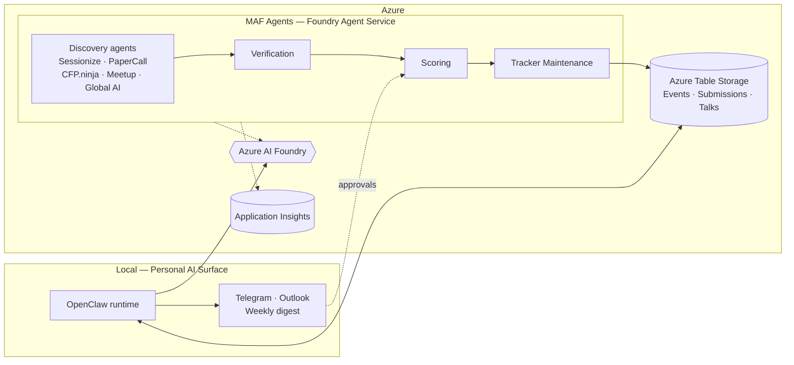

# Speaking Pipeline — Agents

An open, production-shaped reference for running a real personal speaking pipeline as a multi-agent system on Azure.

## The two-platform hook

This repo deliberately combines two agent platforms. **Microsoft Agent Framework (MAF)** runs the cloud backbone — discovery, verification, scoring, and tracker maintenance agents hosted in Azure AI Foundry Agent Service. **OpenClaw** runs locally as the personal-AI surface layer — weekly digest, Telegram and Outlook interfaces, and the approval gate that sits in front of any outbound action. Both share **Azure AI Foundry** as the model layer, so prompts and tools target one model fabric, not two.

Why both: MAF is the right shape for scheduled, observable, multi-agent workloads behind managed identity. OpenClaw is the right shape for a single-operator surface that needs to feel like a personal AI rather than a SaaS dashboard. Treating them as complementary — rather than choosing one — is the case study.

## Architecture



See [docs/architecture-overview.md](docs/architecture-overview.md) for the prose walkthrough and [docs/architecture-table-storage.md](docs/architecture-table-storage.md) for the persistence-layer ground truth.

## Tech stack

- **Microsoft Agent Framework** — multi-agent runtime, hosted in Azure AI Foundry Agent Service
- **OpenClaw** — local personal-AI runtime (`@openclaw/microsoft-foundry` plugin or LiteLLM bridge)
- **Azure AI Foundry** — shared model layer for both platforms
- **Azure Table Storage** — persistence (Events, Submissions, Talks)
- **Managed Identity** — auth into Tables; no connection strings in code
- **OpenTelemetry → Application Insights** — agent traces and metrics
- **.NET** — primary language for MAF agents (Python in scope where it fits)

## Quickstart

> **Status:** Phase 1 — scaffolding. The commands below are placeholders until Phase 2 lands.

```bash
# 1. Provision Azure (resource group, storage account, three tables)
./scripts/provision-azure.sh

# 2. Seed Talks and Events with your canonical data
# TODO Phase 2: pwsh ./scripts/seed-tables.ps1

# 3. Build and deploy the MAF agents
# TODO Phase 2: dotnet build src/

# 4. Run OpenClaw locally against the same model + tables
# TODO Phase 2: openclaw run
```

## Project status

**Phase 1 — scaffolding.** Repo skeleton, schema, samples, contributor docs. No agent code yet.

**Phase 2 — first agent slice.** Tracker maintenance agent + Sessionize discovery agent, end-to-end against real Tables. Scope sketched in [docs/architecture-overview.md](docs/architecture-overview.md).

## Documentation

- [Architecture overview](docs/architecture-overview.md) — how the pieces fit
- [Table Storage schema](docs/architecture-table-storage.md) — persistence ground truth
- [Architecture Decision Records](docs/adr/) — why we picked what we picked
- [Contributing](CONTRIBUTING.md)
- [Security policy](SECURITY.md)

## License

Apache 2.0 — see [LICENSE](LICENSE) and [NOTICE](NOTICE).
