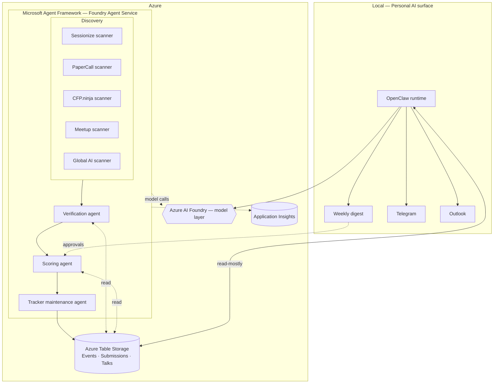

# Architecture Overview

A high-level walk through how this pipeline is shaped. For the persistence contract, see [architecture-table-storage.md](architecture-table-storage.md) — that file is the ground truth for `Events`, `Submissions`, and `Talks`. This document deliberately does not restate the schema; it explains how the agents move data through it.

## One picture

## The two platforms, and why both

**Microsoft Agent Framework (MAF)** is the cloud backbone. It runs the scheduled, observable, multi-agent workload — discovery scans nightly, verification on demand, scoring on a cadence, maintenance continuously. It lives in Azure AI Foundry Agent Service, authenticates via Managed Identity, and emits OpenTelemetry into Application Insights. This is the production-shaped half of the system.

**OpenClaw** is the personal-AI surface. It runs locally, with the same model fabric (Foundry, via plugin or LiteLLM bridge), and is the only path to outbound action — drafting submissions, sending Telegram messages, queuing Outlook follow-ups. It's also where the **approval gate** lives: nothing the agents propose leaves the system until Brian taps approve.

The split matters. The MAF half is observable, role-scoped, idempotent, and re-deployable. The OpenClaw half is intimate, single-operator, and gets to be opinionated about what a personal AI feels like. Forcing both into one platform would compromise one or the other.

## Agent roster

| Agent | Lane | Reads | Writes | Trigger |
|---|---|---|---|---|
| `sessionize-scanner` | Discovery | Sessionize public CFP feed | `Events` (upsert) | Schedule |
| `papercall-scanner` | Discovery | PaperCall public listings | `Events` (upsert) | Schedule |
| `cfpninja-scanner` | Discovery | CFP.ninja listings | `Events` (upsert) | Schedule |
| `meetup-scanner` | Discovery | Meetup API for tracked groups | `Events` (upsert) | Schedule |
| `globalai-scanner` | Discovery | Global AI Chapter pages | `Events` (upsert) | Schedule |
| `verification-agent` | Verification | `Events` + live event URL | `Events.LastVerifiedUtc`, `StatusDetail` | After discovery |
| `scoring-agent` | Scoring | `Events`, `Talks`, `Submissions` | `Events.Category`, `Priority`, `NextAction` | After verification |
| `tracker-maintenance-agent` | Maintenance | `Events`, `Submissions` | `Events`, `Submissions`, `Talks` (status flips, denormalized fields) | Continuous |

OpenClaw is not an MAF agent — it's the local surface that reads the resulting tables and proposes outbound action.

## Data flow, end-to-end

1. **Discover.** Per-source agents scan their feed, slug-sanitize candidate events, and upsert into `Events` with `DiscoveredByAgent` set and `SchemaVersion = 1`.
2. **Verify.** The verification agent hits the live event URL, confirms the CFP is open, and stamps `LastVerifiedUtc` + a free-text `StatusDetail`. Dead links get `Category = Pass`.
3. **Score.** The scoring agent looks at deadline, focus-fit, talk reusability, and travel burden, then sets `Category` (`SubmitNow` / `Monitor` / `Pass`) and `Priority` (`High` / `Medium` / `Low`). `DecidedByAgent` records the version that made the call.
4. **Surface.** OpenClaw reads the result, builds a weekly digest, and offers Brian a one-tap approval for any `SubmitNow` row.
5. **Submit.** On approval, OpenClaw drafts the submission and (eventually) posts it. A new row lands in `Submissions` with `Status = Submitted` and a denormalized `EventName`.
6. **Maintain.** The tracker maintenance agent watches for status flips (e.g. `Submitted` → `Accepted`), updates the corresponding `Events.Category` to `Accepted`, increments `Talks.DeliveryCount` on delivered talks, and re-verifies stale rows.

## Cross-cutting concerns

- **Auth:** Managed identity everywhere. The MAF agents get `Storage Table Data Contributor` on the storage account. No connection strings, no SAS tokens.
- **Idempotency:** Every write is an upsert keyed on `(PartitionKey, RowKey)`. Agents are safe to retry. The schema doc lays out batch and concurrency rules — see Gotchas section there.
- **Observability:** OpenTelemetry from day one. Each agent run emits a span with `agent.name`, `agent.version`, table operations as child spans, and outcome counters. Application Insights is the AgentOps surface.
- **Schema evolution:** `SchemaVersion` on every entity. Maintenance agent owns backfills.
- **Approval gating:** No outbound action without explicit human approval. The boundary is the OpenClaw runtime — nothing in the MAF tier is allowed to send mail, post submissions, or message a human.

## Phase 2 — recommended first slice

Build in this order. Each step is small enough to ship in a day.

1. **Provision the Azure resources** (`scripts/provision-azure.sh`) and verify role assignment.
2. **Seed the `Talks` table** with the four canonical lanes (`AgentOps`, `HybridAgents`, `M365Governance`, `PracticalEnterpriseAI`).
3. **Tracker maintenance agent.** Smallest contract, biggest leverage. Reads an event, re-verifies its URL, updates `LastVerifiedUtc`. Wires up auth, OTel, idempotency, and exercises the full MAF deploy story.
4. **Sessionize discovery agent.** First writer into `Events`. One source, narrow scope.
5. **App Insights dashboard.** A live look at agent runs, success rates, and table-op latency. Demo material.

Defer scoring, OpenClaw integration, and the rest of the discovery sources until the above is humming.
